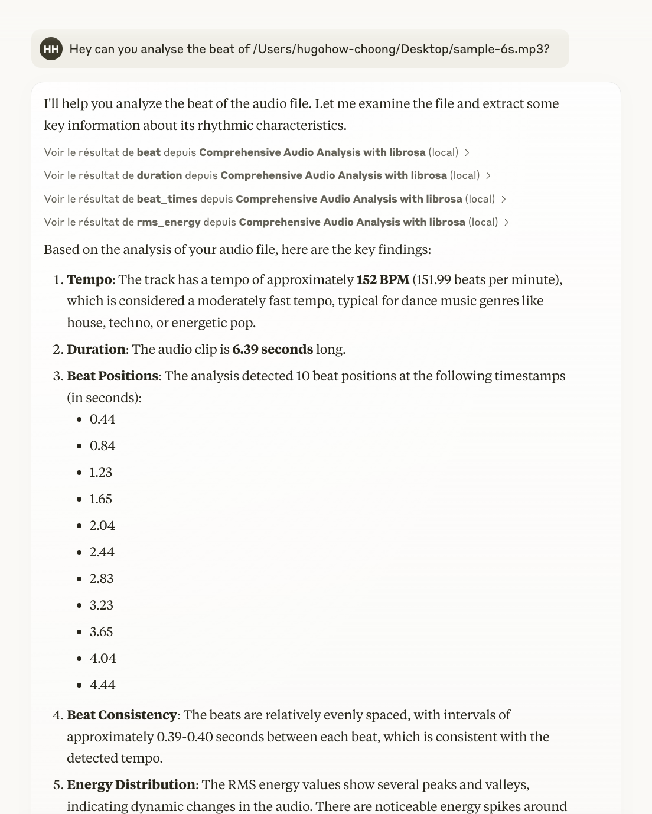

# MCP Audio Analysis

This repository contains a **Model Context Provider (MCP)** that uses [FastMCP](https://github.com/pseudo-url/fastmcp) and [librosa](https://librosa.org/) for audio analysis.

## Usage



## Installation

1. Clone or download this repository.

2. Install dependencies from `requirements.txt`:

```bash
pip3 install -r requirements.txt
```

3. Install the MCP:

```bash
fastmcp install server.py
```

## Example Prompts

Here are some sample prompts you might use in a conversational or chat-based context once the server is running. The MCP will understand these requests and execute the relevant tools:

```
Can you analyze the beat of /Users/hugohow-choong/Desktop/sample-6s.mp3?
Could you give me the duration of /path/to/audio.wav?
Please compute the MFCC for this file: /path/to/another_audio.mp3
What are the spectral centroid values for /path/to/music.wav?
I'd like to know the onset times for /path/to/drum_loop.wav
```

## Author

Hugo How-Choong
